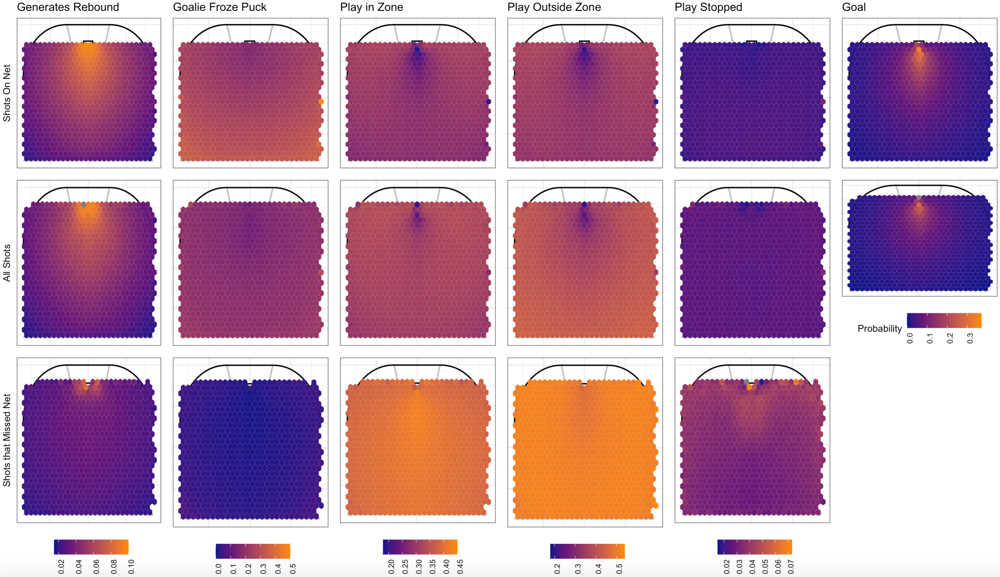
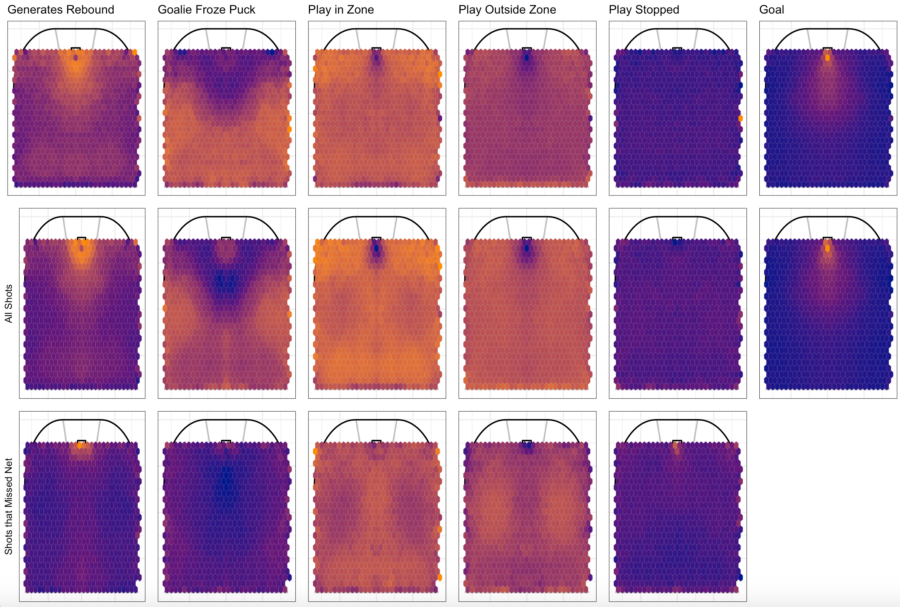

```{r setup, include=FALSE}
options(htmltools.dir.version = FALSE)
knitr::opts_chunk$set(
    fig.retina = 3,
    cache = FALSE,
    echo = FALSE,
    message = FALSE,
    warning = FALSE,
    fig.show = TRUE,
    hiline = TRUE)
```

```{r xaringan-themer, include = FALSE, warning = FALSE}
library(xaringanthemer)
style_mono_accent(base_color = "#4d54a5",
  white_color = "#FFFFFF",
  background_color = "#FFFFFF",
  base_font_size = "24px"
)
```

```{r load-packages, warning = FALSE, message = FALSE, echo = FALSE}
library(tidyverse)
library(haven)
library(nnet)
library(ggthemes)
library(gt)
library(DiagrammeR)
library(stargazer)
library(effects)
library(sjPlot)
library(sjmisc)
library(RColorBrewer)

theme_reach <- function() {
  theme_bw() +
    theme(
      legend.position = "bottom",
      plot.title = element_text(size = 20, hjust = 0.5, face = "bold"),
      plot.subtitle = element_text(size = 12, hjust = 0.5),
      axis.title.x = element_text(size=16),
      axis.title.y = element_text(size=16)
    )
}
```


```{r}
# Load data
# shots2020 <- read_csv("data/shots_2020.csv")
# shots0719 <- read.csv("data/shots_2007-2019.csv")

load("data/shots1019.RData")
load("data/shots2020.RData")
load("data/recent_season.RData")
load("data/all_loso_cv_preds2")

```

## Research Question

- Compare the performance of different models predicting the possible outcomes of a shot

--

- Started with the idea of an expected goals model

--

- Now focused on all of the potential outcomes resulting from a shot in hockey

--

- Want to find the best way to estimate the value of a shot attempt, and potentially a player's impact on that value

---

### What Are the Potential Outcomes from a Shot?

* First, shot can either hit the net or miss the net.

--

* If shot hits the net, it is either a goal or not a goal

--

* If shot hits the net and is not a goal, there are several possible outcomes of that shot coded in the Moneypuck dataset

---

## Flow Chat for Shot Outcomes

````{r, echo=FALSE, fig.align='center',}
knitr::include_graphics("EDA_0716_files/flow.png")
```

---

### The Moneypuck Dataset

Loaded in the dataset of all the shots from 2010 season to 2020 season (includes shots as of 2021/7/8) in NHL from [`moneypuck`](http://www.stat.cmu.edu/cmsac/sure/2021/materials/data/xy_examples/moneypuck_shots_2020.csv)

--

* There's 137 columns of 1,146,536 rows

--

* Each row represent a singular shot taken; contains information about Player info, Info about the shot, Team context, and Game context

--

```{r display-data, warning = FALSE, message = FALSE, echo = FALSE}
recent_season %>% slice_head(n = 4) %>% select(season,awaySkatersOnIce,shotAngleAdjusted,xCordAdjusted,shotType,goal,xGoal) %>% gt()
```

---

### About Moneypuck's Expected Goals Model

* Predicts probability of each shot being a goal

* Uses distance from net, angle of shot, type of shot, and what happened before the shot

* Built on 800,000 shots in the NHL from 2007 - 2015

* Built using gradient boosting


---

### Calibration of Moneypuck xG Model


```{r echo = FALSE, out.width = "60%", fig.align="center"}
recent_season %>%
  mutate(bin_pred_prob = round(xGoal / 0.05) * 0.05) %>%
  group_by(bin_pred_prob) %>%
  summarize(n_attempts = n(),
            bin_actual_prob = mean(goal)) %>%
  ggplot(aes(x = bin_pred_prob, y = bin_actual_prob)) + 
  geom_point(aes(size = n_attempts)) + 
  geom_text(aes(label = n_attempts),
            position = position_nudge(x = 0.05, y = -0.05),
            size = 4)+
  geom_smooth(method = "loess", se = FALSE) + 
  geom_abline(intercept = 0, slope = 1, color = "darkred",
              linetype = "dashed") + 
  coord_equal() + 
  scale_x_continuous(limits = c(0,1)) +
  scale_y_continuous(limits = c(0, 1)) + 
  theme_reach()+ 
  labs(x = "Predicted Probability",
       y = "Actual Probability",
       size = "Number of Attempts")
```


---

## Calibration on subsets: situation


```{r out.width = "50%"}

evenstrength %>%
  mutate(bin_pred_prob = round(xGoal / 0.05) * 0.05) %>%
  group_by(bin_pred_prob) %>%
  summarize(n_attempts = n(),
            bin_actual_prob = mean(goal)) %>%
  ggplot(aes(x = bin_pred_prob, y = bin_actual_prob)) + 
  geom_point(aes(size = n_attempts)) + 
  geom_text(aes(label = n_attempts),
            position = position_nudge(x = 0.05, y = -0.05),
            size = 4) +
  geom_smooth(method = "loess", se = FALSE) + 
  geom_abline(intercept = 0, slope = 1, color = "darkred",
              linetype = "dashed") + 
  coord_equal() + 
  scale_x_continuous(limits = c(0,1)) +
  scale_y_continuous(limits = c(0, 1)) + 
  labs(x = "Predicted Probability",
       y = "Actual Probability",
       size = "Number of Attempts",
       title="Even Strength")+
  theme_reach()

powerplay %>%
  mutate(bin_pred_prob = round(xGoal / 0.05) * 0.05) %>%
  group_by(bin_pred_prob) %>%
  summarize(n_attempts = n(),
            bin_actual_prob = mean(goal)) %>%
  ggplot(aes(x = bin_pred_prob, y = bin_actual_prob)) + 
  geom_point(aes(size = n_attempts)) + 
  geom_text(aes(label = n_attempts),
            position = position_nudge(x = 0.07, y = -0.02),
            size = 4) +
  geom_smooth(method = "loess", se = FALSE) + 
  geom_abline(intercept = 0, slope = 1, color = "darkred",
              linetype = "dashed") + 
  coord_equal() + 
  scale_x_continuous(limits = c(0,1)) +
  scale_y_continuous(limits = c(0, 1)) + 
  labs(x = "Predicted Probability",
       y = "Actual Probability",
       size = "Number of Attempts",
       title="Power Play")+
  theme_reach()

```

---

### Building a Multinomial Logistic Regression Model

* Created an outcome variable for each shot representing the "outcome" of the shot, this was our response variable

--

* Our predictor variables were: Distance from net, shot angle, shot type, whether the shot was a rebound, whether the shot was on a rush

--

* Looked at shots only taken in even strength situations; meaning, 5 players on the ice for both teams

--

* Built 3 models: one including all shots, one with just shots on net, and one with shots that missed the net

---


## Heatmaps from Multinomial Models

```{r, echo=FALSE, fig.align='center'}
knitr::include_graphics("multinom_heatmaps.png")
```

---

## Heatmaps with Legends for Each Column

```{r, echo=FALSE, fig.align='center'}

```

---


### All Shots Model: Calibration Plot


```{r include=FALSE}
ep_cv_loso_calibration_results <- all_loso_cv_preds2 %>%
  pivot_longer(Goal:PlayStopped,
               names_to = "outcome_type",
               values_to = "pred_prob") %>%
  mutate(bin_pred_prob = round(pred_prob / 0.03) * 0.03) %>%
  group_by(outcome_type, bin_pred_prob) %>%
  dplyr::summarize(n_plays = n(),
            n_scoring_event = length(which(outcome == outcome_type)),
            bin_actual_prob = n_scoring_event / n_plays,
            bin_se = sqrt((bin_actual_prob * (1 - bin_actual_prob)) / n_plays)) %>% 
  ungroup() %>%
  mutate(bin_upper = pmin(bin_actual_prob + 2 * bin_se, 1),
         bin_lower = pmax(bin_actual_prob - 2 * bin_se, 0))
```

```{r fig.align='center',out.width="65%"}
ep_cv_loso_calibration_results %>%
  ggplot(aes(x = bin_pred_prob, y = bin_actual_prob)) +
  geom_abline(slope = 1, intercept = 0, color = "black", linetype = "dashed") +
  geom_smooth(se = FALSE) +
  geom_point(aes(size = n_plays)) +
  geom_errorbar(aes(ymin = bin_lower, ymax = bin_upper)) + 
  coord_equal() +
  scale_x_continuous(limits = c(0, 1)) +
  scale_y_continuous(limits = c(0, 1)) +
  theme_bw() +
  theme(legend.position = c(1, .05),
        legend.justification = c(1, 0),
        strip.background = element_blank(),
        axis.text.x = element_text(angle = 90)) +
  facet_wrap(~ outcome_type, ncol = 3)+
  theme_reach()
```

---

### Random Forest Calibration Plot


---

### Random Forest Heatmaps

```{r, echo=FALSE, fig.align='center'}

```


---

### Random Forest Heatmaps with Legend


---


