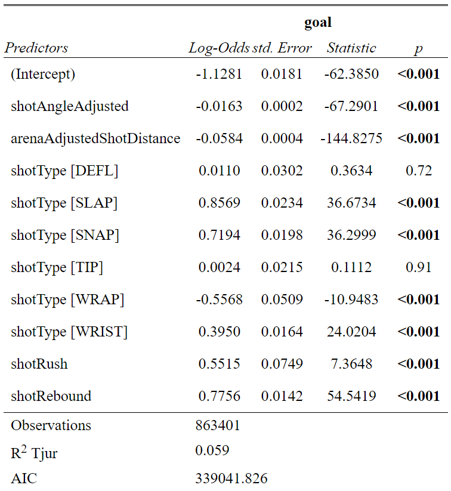

```{r setup, include=FALSE}
options(htmltools.dir.version = FALSE)
knitr::opts_chunk$set(
    fig.retina = 3,
    cache = FALSE,
    echo = FALSE,
    message = FALSE,
    warning = FALSE,
    fig.show = TRUE,
    hiline = TRUE)
```

```{r xaringan-themer, include = FALSE, warning = FALSE}
library(xaringanthemer)
style_mono_accent(base_color = "#4d54a5",
  white_color = "#FFFFFF",
  background_color = "#FFFFFF",
  base_font_size = "24px"
)
```

```{r load-packages, warning = FALSE, message = FALSE, echo = FALSE}
library(tidyverse)
library(haven)
library(nnet)
library(ggthemes)
library(gt)

theme_reach <- function() {
  theme_bw() +
    theme(
      legend.position = "bottom",
      plot.title = element_text(size = 20, hjust = 0.5, face = "bold"),
      plot.subtitle = element_text(size = 12, hjust = 0.5),
      axis.title.x = element_text(size=16),
      axis.title.y = element_text(size=16)
    )
}
```


```{r}
# Load data
shots2020 <- read_csv("data/shots_2020.csv")
shots0719 <- read.csv("data/shots_2007-2019.csv")

# Filter data
shots1019 <- shots0719 %>% 
  filter(season>2009)

variable<- c("arenaAdjustedShotDistance","shotWasOnGoal","shotPlayStopped","shotAngle","shotGoalieFroze","shotPlayContinuedInZone","shotPlayContinuedOutsideZone","awaySkatersOnIce","homeSkatersOnIce","season","shotAngleAdjusted","arenaAdjustedShotDistance","goal","shotGeneratedRebound", "xCordAdjusted", "yCordAdjusted","shotType","shotRush","shotRebound","xGoal")

recent_season <- rbind(select(shots1019,all_of(variable)),select(shots2020,all_of(variable)))
```

```{r}
evenstrength <- 
  recent_season %>% 
  filter(xCordAdjusted %in% c(25:89),
         yCordAdjusted %in% c(-42:42)) %>% 
  filter(homeSkatersOnIce==5 & awaySkatersOnIce==5)

powerplay <-
  recent_season %>% 
  filter(xCordAdjusted %in% c(25:89),
         yCordAdjusted %in% c(-42:42)) %>% 
  filter((homeSkatersOnIce == 4 & awaySkatersOnIce == 5)|
           (homeSkatersOnIce == 5 & awaySkatersOnIce == 4))

deflection <- recent_season %>%
  filter(shotType == "DEFL")

wristshot <- recent_season %>%
  filter(shotType == "WRIST")
```

## Research Question

- Compare the performance of different model predicting the possible outcome of a shot

- Here we consider 6 outcome contioned that the shot was on Goal: Goal, froze by golie, shot generated reboudn, play stop, play continued in zone, and play contined outside zone

- Test on subset: evenstrenth (5vs5) and powerplay (5vs4)

---

### The Moneypuck Dataset

Loaded in the dataset of all the shots from 2010 season to 2020 season (includes shots as of 2021/7/8) in NHL from [`moneypuck`](http://www.stat.cmu.edu/cmsac/sure/2021/materials/data/xy_examples/moneypuck_shots_2020.csv)

```{r}

```


* There's 137 columns of 1,146,536 shots taken

* Each row and observation is a singular shot taken, contain information about Player info,Info about the shot,Team context,Game context

* We select 19 variables for our analysis


```{r display-data, warning = FALSE, message = FALSE, echo = FALSE}
recent_season %>% slice_head(n = 5) %>% select(season,awaySkatersOnIce,shotAngleAdjusted,xCordAdjusted,shotType,goal,xGoal) %>% gt()
```

---

### Calibration of Moneypuck xG Model


```{r echo = FALSE, out.width = "60%", fig.align="center"}
recent_season %>%
  mutate(bin_pred_prob = round(xGoal / 0.05) * 0.05) %>%
  group_by(bin_pred_prob) %>%
  summarize(n_attempts = n(),
            bin_actual_prob = mean(goal)) %>%
  ggplot(aes(x = bin_pred_prob, y = bin_actual_prob)) + 
  geom_point(aes(size = n_attempts)) + 
  geom_text(aes(label = n_attempts),
            position = position_nudge(x = 0.05, y = -0.05),
            size = 4)+
  geom_smooth(method = "loess", se = FALSE) + 
  geom_abline(intercept = 0, slope = 1, color = "darkred",
              linetype = "dashed") + 
  coord_equal() + 
  scale_x_continuous(limits = c(0,1)) +
  scale_y_continuous(limits = c(0, 1)) + 
  theme_reach()+ 
  labs(x = "Predicted Probability",
       y = "Actual Probability",
       size = "Number of Attempts")
```


---

## Calibration on subsets: situation


```{r out.width = "50%"}

evenstrength %>%
  mutate(bin_pred_prob = round(xGoal / 0.05) * 0.05) %>%
  group_by(bin_pred_prob) %>%
  summarize(n_attempts = n(),
            bin_actual_prob = mean(goal)) %>%
  ggplot(aes(x = bin_pred_prob, y = bin_actual_prob)) + 
  geom_point(aes(size = n_attempts)) + 
  geom_text(aes(label = n_attempts),
            position = position_nudge(x = 0.05, y = -0.05),
            size = 4) +
  geom_smooth(method = "loess", se = FALSE) + 
  geom_abline(intercept = 0, slope = 1, color = "darkred",
              linetype = "dashed") + 
  coord_equal() + 
  scale_x_continuous(limits = c(0,1)) +
  scale_y_continuous(limits = c(0, 1)) + 
  labs(x = "Predicted Probability",
       y = "Actual Probability",
       size = "Number of Attempts",
       title="Powerplay")+
  theme_reach()

powerplay %>%
  mutate(bin_pred_prob = round(xGoal / 0.05) * 0.05) %>%
  group_by(bin_pred_prob) %>%
  summarize(n_attempts = n(),
            bin_actual_prob = mean(goal)) %>%
  ggplot(aes(x = bin_pred_prob, y = bin_actual_prob)) + 
  geom_point(aes(size = n_attempts)) + 
  geom_text(aes(label = n_attempts),
            position = position_nudge(x = 0.07, y = -0.02),
            size = 4) +
  geom_smooth(method = "loess", se = FALSE) + 
  geom_abline(intercept = 0, slope = 1, color = "darkred",
              linetype = "dashed") + 
  coord_equal() + 
  scale_x_continuous(limits = c(0,1)) +
  scale_y_continuous(limits = c(0, 1)) + 
  labs(x = "Predicted Probability",
       y = "Actual Probability",
       size = "Number of Attempts",
       title="Penalty Kill")+
  theme_reach()

```

---

## Calibration on subsets: shotType

```{r out.width = "50%"}

wristshot %>%
  mutate(bin_pred_prob = round(xGoal / 0.05) * 0.05) %>%
  group_by(bin_pred_prob) %>%
  summarize(n_attempts = n(),
            bin_actual_prob = mean(goal)) %>%
  ggplot(aes(x = bin_pred_prob, y = bin_actual_prob)) + 
  geom_point(aes(size = n_attempts)) + 
  geom_text(aes(label = n_attempts),
            position = position_nudge(x = 0.05, y = -0.05),
            size = 4) +
  geom_smooth(method = "loess", se = FALSE) + 
  geom_abline(intercept = 0, slope = 1, color = "darkred",
              linetype = "dashed") + 
  coord_equal() + 
  scale_x_continuous(limits = c(0,1)) +
  scale_y_continuous(limits = c(0, 1)) + 
  labs(x = "Predicted Probability",
       y = "Actual Probability",
       size = "Number of Attempts",
       title="Powerplay")+
  theme_reach()

deflection %>%
  mutate(bin_pred_prob = round(xGoal / 0.05) * 0.05) %>%
  group_by(bin_pred_prob) %>%
  summarize(n_attempts = n(),
            bin_actual_prob = mean(goal)) %>%
  ggplot(aes(x = bin_pred_prob, y = bin_actual_prob)) + 
  geom_point(aes(size = n_attempts)) + 
  geom_text(aes(label = n_attempts),
            position = position_nudge(x = 0.07, y = -0.02),
            size = 4) +
  geom_smooth(method = "loess", se = FALSE) + 
  geom_abline(intercept = 0, slope = 1, color = "darkred",
              linetype = "dashed") + 
  coord_equal() + 
  scale_x_continuous(limits = c(0,1)) +
  scale_y_continuous(limits = c(0, 1)) + 
  labs(x = "Predicted Probability",
       y = "Actual Probability",
       size = "Number of Attempts",
       title="Penalty Kill")+
  theme_reach()

```

---

## Build basic logistic model

```{r, echo=FALSE, out.width="55%",fig.align='center'}

```

---


## Heat Map


---

## Multinomial Logistic Model

```{r}
multi <- recent_season %>% 
  filter(shotWasOnGoal==1,
         !is.na(shotType),
         shotType!="",
         homeSkatersOnIce==5 & awaySkatersOnIce==5)


# 21 observation that is both goal and froze, 5 NA shotType and 164 "" shotType
# for 2 of 164 "", all 6 outcomes are 0.

multi<-multi %>% 
  mutate(outcome=case_when(shotGoalieFroze==1 ~ "GoalieFroze",
                           goal==1 ~"Goal",
                           shotGeneratedRebound == 1 ~ "GeneratesRebound",
                           shotPlayContinuedInZone == 1 ~ "PlayInZone",
                           shotPlayContinuedOutsideZone == 1 ~ "PlayOutsideZone",
                           shotPlayStopped == 1 ~ "PlayStopped"))

multi$outcome <- relevel(as.factor(multi$outcome),ref="Goal")
multi$shotType <- as.factor(multi$shotType)


multi_mo <- multinom(outcome ~ shotAngleAdjusted+arenaAdjustedShotDistance+shotType+shotRush+shotRebound, 
                     data = multi,
                     model=TRUE)
```

---

##  Multinomial Logistic Model

```{r}
knitr::kable(head(multi_mo$fitted.values,5))
```

---


## Flow Chat for shot outcome


---


### Conclusion


### Limitations and Next Step


#### Fell free to ask any quesitons!
---


### Appendix
