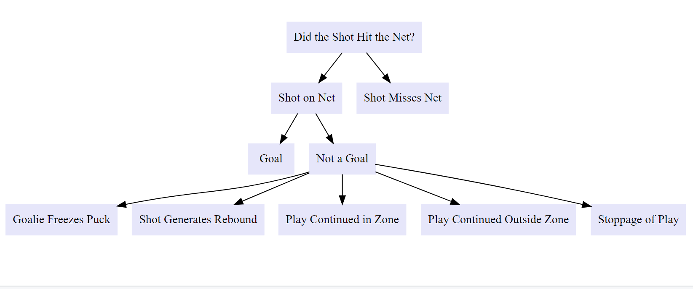

```{r setup, include=FALSE}
options(htmltools.dir.version = FALSE)
knitr::opts_chunk$set(
    fig.retina = 3,
    cache = FALSE,
    echo = FALSE,
    message = FALSE,
    warning = FALSE,
    fig.show = TRUE,
    hiline = TRUE)
```

```{r xaringan-themer, include = FALSE, warning = FALSE}
library(xaringanthemer)
style_mono_accent(base_color = "#4d54a5",
  white_color = "#FFFFFF",
  background_color = "#FFFFFF",
  base_font_size = "24px"
)
```

```{r load-packages, warning = FALSE, message = FALSE, echo = FALSE}
library(tidyverse)
library(haven)
library(nnet)
library(ggthemes)
library(gt)
library(DiagrammeR)
library(stargazer)
library(effects)
library(sjPlot)
library(sjmisc)
library(RColorBrewer)

theme_reach <- function() {
  theme_bw() +
    theme(
      legend.position = "bottom",
      plot.title = element_text(size = 20, hjust = 0.5, face = "bold"),
      plot.subtitle = element_text(size = 12, hjust = 0.5),
      axis.title.x = element_text(size=16),
      axis.title.y = element_text(size=16)
    )
}
```


```{r}
# Load data
# shots2020 <- read_csv("data/shots_2020.csv")
# shots0719 <- read.csv("data/shots_2007-2019.csv")

#load("shots1019.RData")
#load("shots2020.RData")
load("recent_season.RData")
load("multi_coe.RData")

# recent_season <- 
#  rbind(
#    select(
#      shots1019,
#      shotGoalieFroze,shotPlayContinuedInZone,
#      shotPlayContinuedOutsideZone,season,shotAngleAdjusted,
#      arenaAdjustedShotDistance,goal,shotGeneratedRebound, 
#      xCordAdjusted, yCordAdjusted, shotAngle, homeSkatersOnIce, 
#      awaySkatersOnIce, shotType, shotRush, shotRebound, 
#     shotWasOnGoal, xGoal, shotPlayStopped),
#    select(shots2020,shotGoalieFroze,shotPlayContinuedInZone,
#           shotPlayContinuedOutsideZone,season,
#           shotAngleAdjusted,arenaAdjustedShotDistance,goal,
#           shotGeneratedRebound, xCordAdjusted, yCordAdjusted, 
#           shotAngle, homeSkatersOnIce, awaySkatersOnIce, 
#           shotType, shotRush, shotRebound, shotWasOnGoal,
#           xGoal, shotPlayStopped))
```

```{r}
evenstrength <- 
  recent_season %>% 
  filter(xCordAdjusted %in% c(25:89),
         yCordAdjusted %in% c(-42:42)) %>% 
  filter(homeSkatersOnIce==5 & awaySkatersOnIce==5)

powerplay <-
  recent_season %>% 
  filter(xCordAdjusted %in% c(25:89),
         yCordAdjusted %in% c(-42:42)) %>% 
  filter((homeSkatersOnIce == 4 & awaySkatersOnIce == 5)|
           (homeSkatersOnIce == 5 & awaySkatersOnIce == 4))

deflection <- recent_season %>%
  filter(shotType == "DEFL")

wristshot <- recent_season %>%
  filter(shotType == "WRIST")

xg_logit_even <- glm(goal ~ shotAngleAdjusted+arenaAdjustedShotDistance,
                                 data = evenstrength,
                                 family = binomial("logit")) 

rebound_logit_even <- glm(shotGeneratedRebound ~ shotAngleAdjusted+arenaAdjustedShotDistance+
                   shotType+shotRush+shotRebound,
                     data = evenstrength,
                     family = binomial("logit")) 


freeze_logit_even <- glm(shotGoalieFroze ~ shotAngleAdjusted+arenaAdjustedShotDistance+
                   shotType+shotRush+shotRebound,
                     data = evenstrength,
                     family = binomial("logit")) 

inzone_logit_even <- glm(shotPlayContinuedInZone ~ shotAngleAdjusted+arenaAdjustedShotDistance+
                   shotType+shotRush+shotRebound,
                         data = evenstrength,
                         family = binomial("logit")) 

outzone_logit_even <- glm(shotPlayContinuedOutsideZone ~ shotAngleAdjusted+arenaAdjustedShotDistance+
                   shotType+shotRush+shotRebound,
                         data = evenstrength,
                         family = binomial("logit")) 

ongoal_logit_even <- glm(shotWasOnGoal ~ shotAngleAdjusted+arenaAdjustedShotDistance+
                   shotType+shotRush+shotRebound,
                         data = evenstrength,
                         family = binomial("logit")) 

stop_logit_even <- glm(shotPlayStopped ~ shotAngleAdjusted+arenaAdjustedShotDistance+
                   shotType+shotRush+shotRebound,
                         data = evenstrength,
                         family = binomial("logit")) 
```

## Research Question

- Compare the performance of different models predicting the possible outcomes of a shot

--

- Started with the idea of an expected goals model

--

- Now focused on all of the potential outcomes resulting from a shot in hockey

---

### What Are the Potential Outcomes from a Shot?

* First, shot can either hit the net or miss the net.

--

* If shot hits the net, it is either a goal or not a goal

--

* If shot hits the net and is not a goal, there are several possible outcomes of that shot coded in the Moneypuck dataset


---


## Flow Chat for Shot Outcomes

````{r, echo=FALSE, fig.align='center',}

```

---

### The Moneypuck Dataset

Loaded in the dataset of all the shots from 2010 season to 2020 season (includes shots as of 2021/7/8) in NHL from [`moneypuck`](http://www.stat.cmu.edu/cmsac/sure/2021/materials/data/xy_examples/moneypuck_shots_2020.csv)

--

* There's 137 columns of 1,146,536 rows

--

* Each row represent a singular shot taken; contain information about Player info, Info about the shot, Team context, and Game context

--

* We select 19 variables for our analysis


```{r display-data, warning = FALSE, message = FALSE, echo = FALSE}
recent_season %>% slice_head(n = 4) %>% select(season,awaySkatersOnIce,shotAngleAdjusted,xCordAdjusted,shotType,goal,xGoal) %>% gt()
```

---

### About Moneypuck's Expected Goals Model

* Predicts probability of each shot being a goal

* Uses distance from net, angle of shot, type of shot, and what happened before the shot

* Built on 800,000 shots in the NHL from 2007 - 2015

* Built using gradient boosting


---

### Calibration of Moneypuck xG Model


```{r echo = FALSE, out.width = "60%", fig.align="center"}
recent_season %>%
  mutate(bin_pred_prob = round(xGoal / 0.05) * 0.05) %>%
  group_by(bin_pred_prob) %>%
  summarize(n_attempts = n(),
            bin_actual_prob = mean(goal)) %>%
  ggplot(aes(x = bin_pred_prob, y = bin_actual_prob)) + 
  geom_point(aes(size = n_attempts)) + 
  geom_text(aes(label = n_attempts),
            position = position_nudge(x = 0.05, y = -0.05),
            size = 4)+
  geom_smooth(method = "loess", se = FALSE) + 
  geom_abline(intercept = 0, slope = 1, color = "darkred",
              linetype = "dashed") + 
  coord_equal() + 
  scale_x_continuous(limits = c(0,1)) +
  scale_y_continuous(limits = c(0, 1)) + 
  theme_reach()+ 
  labs(x = "Predicted Probability",
       y = "Actual Probability",
       size = "Number of Attempts")
```


---

## Calibration on subsets: situation


```{r out.width = "50%"}

evenstrength %>%
  mutate(bin_pred_prob = round(xGoal / 0.05) * 0.05) %>%
  group_by(bin_pred_prob) %>%
  summarize(n_attempts = n(),
            bin_actual_prob = mean(goal)) %>%
  ggplot(aes(x = bin_pred_prob, y = bin_actual_prob)) + 
  geom_point(aes(size = n_attempts)) + 
  geom_text(aes(label = n_attempts),
            position = position_nudge(x = 0.05, y = -0.05),
            size = 4) +
  geom_smooth(method = "loess", se = FALSE) + 
  geom_abline(intercept = 0, slope = 1, color = "darkred",
              linetype = "dashed") + 
  coord_equal() + 
  scale_x_continuous(limits = c(0,1)) +
  scale_y_continuous(limits = c(0, 1)) + 
  labs(x = "Predicted Probability",
       y = "Actual Probability",
       size = "Number of Attempts",
       title="Powerplay")+
  theme_reach()

powerplay %>%
  mutate(bin_pred_prob = round(xGoal / 0.05) * 0.05) %>%
  group_by(bin_pred_prob) %>%
  summarize(n_attempts = n(),
            bin_actual_prob = mean(goal)) %>%
  ggplot(aes(x = bin_pred_prob, y = bin_actual_prob)) + 
  geom_point(aes(size = n_attempts)) + 
  geom_text(aes(label = n_attempts),
            position = position_nudge(x = 0.07, y = -0.02),
            size = 4) +
  geom_smooth(method = "loess", se = FALSE) + 
  geom_abline(intercept = 0, slope = 1, color = "darkred",
              linetype = "dashed") + 
  coord_equal() + 
  scale_x_continuous(limits = c(0,1)) +
  scale_y_continuous(limits = c(0, 1)) + 
  labs(x = "Predicted Probability",
       y = "Actual Probability",
       size = "Number of Attempts",
       title="Penalty Kill")+
  theme_reach()

```

---

## Calibration on subsets: shotType

```{r out.width = "50%"}

wristshot %>%
  mutate(bin_pred_prob = round(xGoal / 0.05) * 0.05) %>%
  group_by(bin_pred_prob) %>%
  summarize(n_attempts = n(),
            bin_actual_prob = mean(goal)) %>%
  ggplot(aes(x = bin_pred_prob, y = bin_actual_prob)) + 
  geom_point(aes(size = n_attempts)) + 
  geom_text(aes(label = n_attempts),
            position = position_nudge(x = 0.05, y = -0.05),
            size = 4) +
  geom_smooth(method = "loess", se = FALSE) + 
  geom_abline(intercept = 0, slope = 1, color = "darkred",
              linetype = "dashed") + 
  coord_equal() + 
  scale_x_continuous(limits = c(0,1)) +
  scale_y_continuous(limits = c(0, 1)) + 
  labs(x = "Predicted Probability",
       y = "Actual Probability",
       size = "Number of Attempts",
       title="Powerplay")+
  theme_reach()

deflection %>%
  mutate(bin_pred_prob = round(xGoal / 0.05) * 0.05) %>%
  group_by(bin_pred_prob) %>%
  summarize(n_attempts = n(),
            bin_actual_prob = mean(goal)) %>%
  ggplot(aes(x = bin_pred_prob, y = bin_actual_prob)) + 
  geom_point(aes(size = n_attempts)) + 
  geom_text(aes(label = n_attempts),
            position = position_nudge(x = 0.07, y = -0.02),
            size = 4) +
  geom_smooth(method = "loess", se = FALSE) + 
  geom_abline(intercept = 0, slope = 1, color = "darkred",
              linetype = "dashed") + 
  coord_equal() + 
  scale_x_continuous(limits = c(0,1)) +
  scale_y_continuous(limits = c(0, 1)) + 
  labs(x = "Predicted Probability",
       y = "Actual Probability",
       size = "Number of Attempts",
       title="Penalty Kill")+
  theme_reach()

```

---

## Build basic logistic model

```{r, echo=FALSE, out.width="55%",fig.align='center'}

```

---


## Shot on Goal Heatmap

```{r fig.align="center"}
source('rink.r')  
g <- rink 

g + 
  stat_summary_hex(data = evenstrength,
                   aes(x = yCordAdjusted,
                       y = xCordAdjusted,
                       # fill = after_stat(level)),
                       z = ongoal_logit_even$fitted.values),
                   binwidth = c(3,3),
                   color = "black",
                   fun = mean) +
  scale_fill_gradient(low = "darkblue",
                      high = "darkorange") +
   ylim(25, 100) +
  theme_bw()
```


---

## Each Outcome We Looked At


```{r echo=FALSE,fig.align="center", fig.show="hold", out.width="80%",fig.width = 11, fig.height = 7}

plot1 <- g + 
  stat_summary_hex(data = evenstrength,
                   aes(x = yCordAdjusted,
                       y = xCordAdjusted,
                       # fill = after_stat(level)),
                       z = xg_logit_even$fitted.values),
                   binwidth = c(3,3),
                   color = "black",
                   fun = mean) +
  scale_fill_gradient(low = "darkblue",
                      high = "darkorange") +
  labs(title = "Expected Goal") +
   ylim(25, 100) +
  theme_bw()
 
plot2 <- g + 
  stat_summary_hex(data = evenstrength,
                   aes(x = yCordAdjusted,
                       y = xCordAdjusted,
                       # fill = after_stat(level)),
                       z = rebound_logit_even$fitted.values),
                   binwidth = c(3,3),
                   color = "black",
                   fun = mean) +
  scale_fill_gradient(low = "darkblue",
                      high = "darkorange") +
   ylim(25, 100) +
  labs(title = "Rebound") +
  theme_bw()

plot3 <- g + 
  stat_summary_hex(data = evenstrength,
                   aes(x = yCordAdjusted,
                       y = xCordAdjusted,
                       # fill = after_stat(level)),
                       z = freeze_logit_even$fitted.values),
                   binwidth = c(3,3),
                   color = "black",
                   fun = mean) +
  scale_fill_gradient(low = "darkblue",
                      high = "darkorange") +
  labs(title = "Goalie Froze") +
   ylim(25, 100) +
  theme_bw()

plot4 <-
   g + 
  stat_summary_hex(data = evenstrength,
                   aes(x = yCordAdjusted,
                       y = xCordAdjusted,
                       # fill = after_stat(level)),
                       z = inzone_logit_even$fitted.values),
                   binwidth = c(3,3),
                   color = "black",
                   fun = mean) +
  scale_fill_gradient(low = "darkblue",
                      high = "darkorange")  +
  labs(title = "Play in Zone") +
   ylim(25, 100) +
  theme_bw()

plot5 <-g + 
  stat_summary_hex(data = evenstrength,
                   aes(x = yCordAdjusted,
                       y = xCordAdjusted,
                       # fill = after_stat(level)),
                       z = outzone_logit_even$fitted.values),
                   binwidth = c(3,3),
                   color = "black",
                   fun = mean) +
  scale_fill_gradient(low = "darkblue",
                      high = "darkorange") +
  labs(title = "Play Out Zone") +
   ylim(25, 100) +
  theme_bw()

plot6 <- g + 
  stat_summary_hex(data = evenstrength,
                   aes(x = yCordAdjusted,
                       y = xCordAdjusted,
                       # fill = after_stat(level)),
                       z = stop_logit_even$fitted.values),
                   binwidth = c(3,3),
                   color = "black",
                   fun = mean) +
  scale_fill_gradient(low = "darkblue",
                      high = "darkorange") +
  labs(title = "Goalie Stop") +
   ylim(25, 100) +
  theme_bw()
 
plot7 <-  g + 
  stat_summary_hex(data = evenstrength,
                   aes(x = yCordAdjusted,
                       y = xCordAdjusted,
                       # fill = after_stat(level)),
                       z = ongoal_logit_even$fitted.values),
                   binwidth = c(3,3),
                   color = "black",
                   fun = mean) +
  scale_fill_gradient(low = "darkblue",
                      high = "darkorange") +
  labs(title = "Shot on Goal") +
   ylim(25, 100) +
  theme_bw()

gridExtra::grid.arrange(plot1, plot2, plot3, plot4, plot5, plot6,
                        nrow = 2)


```


---

## Multinomial Logistic Model

```{r include = FALSE}
multi <- recent_season %>% 
  filter(shotWasOnGoal==1,
         !is.na(shotType),
         shotType!="",
         homeSkatersOnIce==5 & awaySkatersOnIce==5)


# 21 observation that is both goal and froze, 5 NA shotType and 164 "" shotType
# for 2 of 164 "", all 6 outcomes are 0.

multi<-multi %>% 
  mutate(outcome=case_when(shotGoalieFroze==1 ~ "GoalieFroze",
                           goal==1 ~"Goal",
                           shotGeneratedRebound == 1 ~ "GeneratesRebound",
                           shotPlayContinuedInZone == 1 ~ "PlayInZone",
                           shotPlayContinuedOutsideZone == 1 ~ "PlayOutsideZone",
                           shotPlayStopped == 1 ~ "PlayStopped"))

multi$outcome <- relevel(as.factor(multi$outcome),ref="Goal")
multi$shotType <- as.factor(multi$shotType)


multi_mo <- multinom(outcome ~ shotAngleAdjusted+arenaAdjustedShotDistance+shotType+shotRush+shotRebound, 
                     data = multi,
                     model=TRUE)
```

```{r coe_plot, fig.align="center"}
multi_coe %>%
  ggplot(aes(x = outcome, y = variable)) +
  geom_tile(aes(fill = value), color = "black") +
  geom_text(aes(label=round(value, digits = 4)),
            size=3,color = "black") +
  scale_x_discrete(position = "top")+
  scale_fill_distiller(palette='RdBu',direction=-1, limits=c(-1.2,1.2))+
  theme_reach()+
  labs(title="Coe")
```

---

##  Multinomial Logistic Model

```{r fig.show="hold", out.width = "65%",fig.align='center'}
plot(Effect("shotType", multi_mo), multiline = T) 

```

---


### Conclusion

### Limitations and Next Step


#### Fell free to ask any quesitons!
