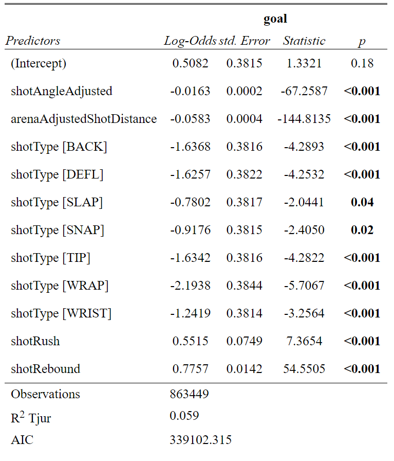
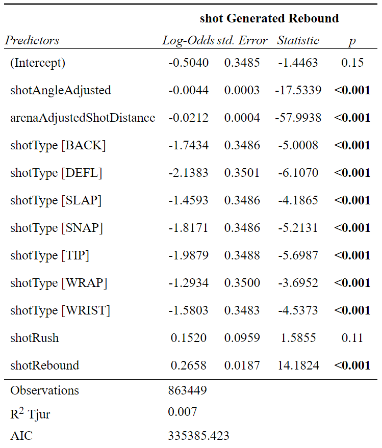
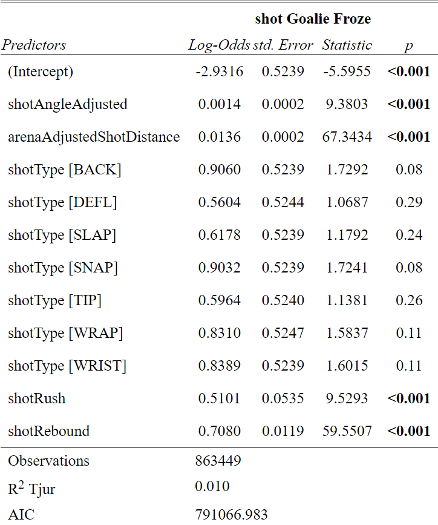
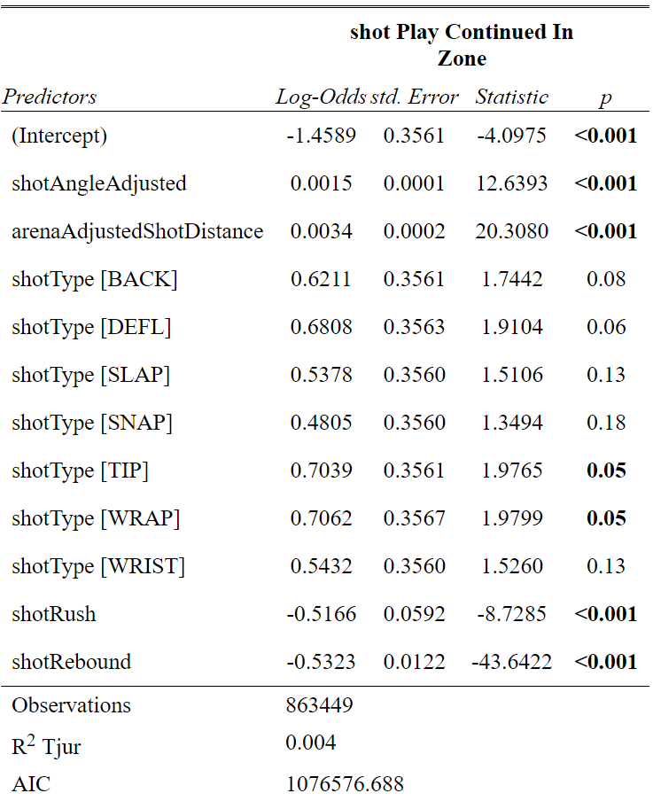
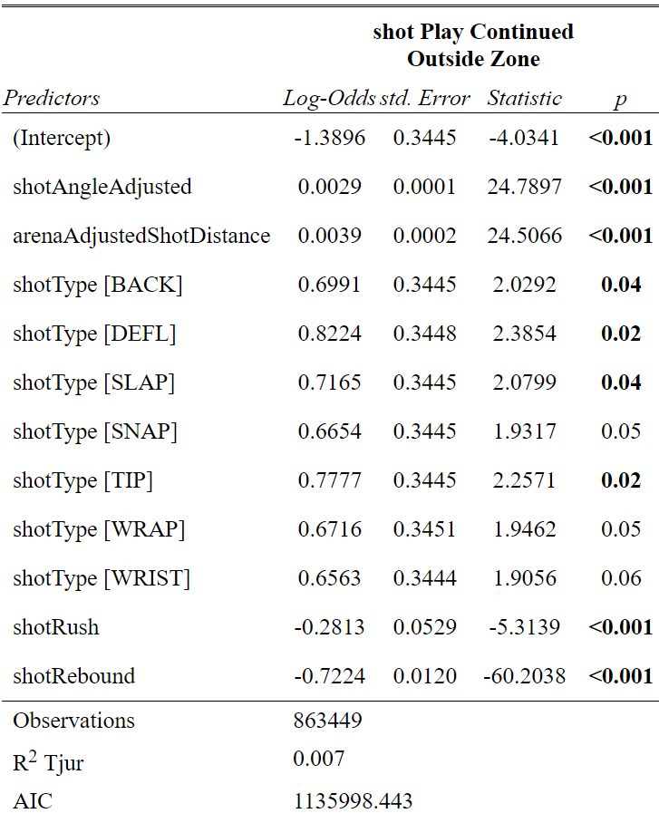
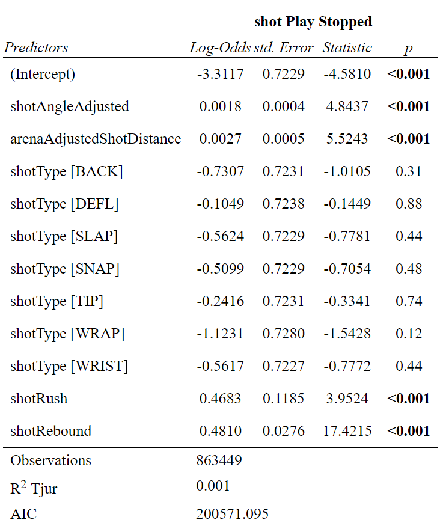

```{r setup, include=FALSE}
options(htmltools.dir.version = FALSE)
knitr::opts_chunk$set(
    fig.retina = 3,
    cache = FALSE,
    echo = FALSE,
    message = FALSE,
    warning = FALSE,
    fig.show = TRUE,
    hiline = TRUE)
```

```{r xaringan-themer, include = FALSE, warning = FALSE}
library(xaringanthemer)
style_mono_accent(base_color = "#4d54a5",
  white_color = "#FFFFFF",
  background_color = "#FFFFFF",
  base_font_size = "24px"
)
```

```{r load packages and data}
# Load packages
library(tidyverse)
library(data.table)
library(sjPlot)

# Load data
shots2020 <- read_csv("data/shots_2020.csv")
shots0719 <- read.csv("data/shots_2007-2019.csv")

# Filter data
shots1019 <- shots0719 %>% 
  filter(season>2009)

variable<- c("arenaAdjustedShotDistance","shotWasOnGoal","shotPlayStopped","shotAngle","shotGoalieFroze","shotPlayContinuedInZone","shotPlayContinuedOutsideZone","awaySkatersOnIce","homeSkatersOnIce","season","shotAngleAdjusted","arenaAdjustedShotDistance","goal","shotGeneratedRebound", "xCordAdjusted", "yCordAdjusted","shotType","shotRush","shotRebound")

recent_season <- rbind(select(shots1019,all_of(variable)),select(shots2020,all_of(variable)))

evenstrength <- 
  recent_season %>% 
  filter(xCordAdjusted %in% c(25:89),
         yCordAdjusted %in% c(-42:42)) %>% 
  filter(homeSkatersOnIce==5 & awaySkatersOnIce==5)

powerplay <-
  recent_season %>%
  filter(xCordAdjusted %in% c(25:89),
         yCordAdjusted %in% c(-42:42)) %>% 
  filter((homeSkatersOnIce == 4 & awaySkatersOnIce == 5),
         (homeSkatersOnIce == 5 & awaySkatersOnIce == 4))

dat_list = split(recent_season, recent_season$season)
  
```

## The probelm

---

## Goal

```{r}
xG_logit_even <- glm(goal ~                        shotAngleAdjusted+arenaAdjustedShotDistance+shotType+shotRush+shotRebound,
               data = evenstrength,
               family = binomial("logit"))
```


---

## Rebound 

```{r}
reb_logit_even <- glm(shotGeneratedRebound ~                        shotAngleAdjusted+arenaAdjustedShotDistance+shotType+shotRush+shotRebound,
               data = evenstrength,
               family = binomial("logit"))
```



---

## Freeze

```{r}
froze_logit_even <- glm(shotGoalieFroze ~                        shotAngleAdjusted+arenaAdjustedShotDistance+shotType+shotRush+shotRebound,
               data = evenstrength,
               family = binomial("logit"))
```



---

## InZone

```{r}
inZone_logit_even <- glm(shotPlayContinuedInZone ~                        shotAngleAdjusted+arenaAdjustedShotDistance+shotType+shotRush+shotRebound,
               data = evenstrength,
               family = binomial("logit"))
```



---

## OutofZone

```{r}
outZone_logit_even <- glm(shotPlayContinuedOutsideZone ~                        shotAngleAdjusted+arenaAdjustedShotDistance+shotType+shotRush+shotRebound,
               data = evenstrength,
               family = binomial("logit"))

```



---

## Stopped

```{r}
stop_logit_even <- glm(shotPlayStopped ~                        shotAngleAdjusted+arenaAdjustedShotDistance+shotType+shotRush+shotRebound,
               data = evenstrength,
               family = binomial("logit"))
```



---


## ShotOnGoal%

```{r}
shotOnGoal_logit_even <- glm(shotWasOnGoal ~                        shotAngleAdjusted+arenaAdjustedShotDistance+shotType+shotRush+shotRebound,
               data = evenstrength,
               family = binomial("logit"))
```


---