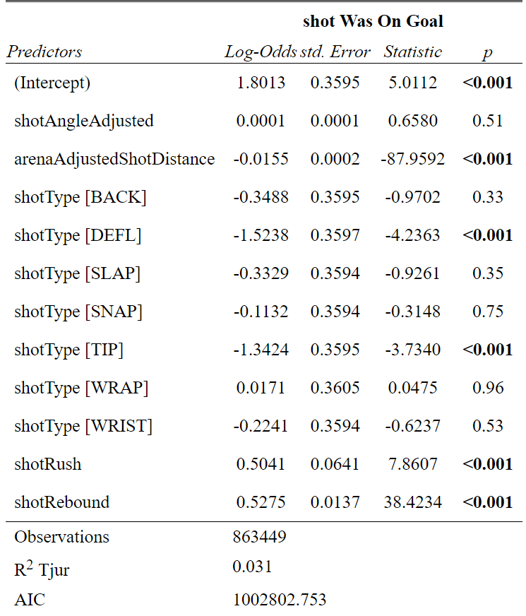

```{r setup, include=FALSE}
options(htmltools.dir.version = FALSE)
knitr::opts_chunk$set(
    fig.retina = 3,
    cache = FALSE,
    echo = FALSE,
    message = FALSE,
    warning = FALSE,
    fig.show = TRUE,
    hiline = TRUE)
```

```{r xaringan-themer, include = FALSE, warning = FALSE}
library(xaringanthemer)
style_mono_accent(base_color = "#4d54a5",
  white_color = "#FFFFFF",
  background_color = "#FFFFFF",
  base_font_size = "24px"
)
```

```{r load packages and data}
# Load packages
library(tidyverse)
library(data.table)
library(sjPlot)

# Load data
shots2020 <- read_csv("data/shots_2020.csv")
shots0719 <- read.csv("data/shots_2007-2019.csv")

# Filter data
shots1019 <- shots0719 %>% 
  filter(season>2009)

variable<- c("arenaAdjustedShotDistance","shotWasOnGoal","shotPlayStopped","shotAngle","shotGoalieFroze","shotPlayContinuedInZone","shotPlayContinuedOutsideZone","awaySkatersOnIce","homeSkatersOnIce","season","shotAngleAdjusted","arenaAdjustedShotDistance","goal","shotGeneratedRebound", "xCordAdjusted", "yCordAdjusted","shotType","shotRush","shotRebound")

recent_season <- rbind(select(shots1019,all_of(variable)),select(shots2020,all_of(variable)))

evenstrength <- 
  recent_season %>% 
  filter(xCordAdjusted %in% c(25:89),
         yCordAdjusted %in% c(-42:42)) %>% 
  filter(homeSkatersOnIce==5 & awaySkatersOnIce==5)

powerplay <-
  recent_season %>%
  filter(xCordAdjusted %in% c(25:89),
         yCordAdjusted %in% c(-42:42)) %>% 
  filter((homeSkatersOnIce == 4 & awaySkatersOnIce == 5),
         (homeSkatersOnIce == 5 & awaySkatersOnIce == 4))

dat_list = split(recent_season, recent_season$season)
  
```

```{r}
xg_logit_odd <- glm(goal ~ shotAngleAdjusted+arenaAdjustedShotDistance,
                     data = powerplay,
                     family = binomial("logit"))
reb_logit_odd <- glm(shotGeneratedRebound ~                        shotAngleAdjusted+arenaAdjustedShotDistance+shotType+shotRush+shotRebound,
               data = powerplay,
               family = binomial("logit"))
freeze_logit_odd <- glm(shotGoalieFroze ~ shotAngleAdjusted+arenaAdjustedShotDistance,
                    data = powerplay,
                    family = binomial("logit")) 
```


## The problem

<<<<<<< HEAD
* <p> How do different shot angles and distances impact the outcome of the shot? </p>
* <p> Now including variables: Shot type, whether or not the shot was on a rush, whether or not the shot was a rebound </p>
* <p> Looking first at only shots in 5 on 5 situations

=======
- 
-
-
>>>>>>> 23752bd49bbc224bed7346c2020db59c33ab59b0

---

### Goal

```{r}
xG_logit_even <- glm(goal ~                        shotAngleAdjusted+arenaAdjustedShotDistance+shotType+shotRush+shotRebound,
               data = evenstrength,
               family = binomial("logit"))
```

```{r, echo=FALSE, out.width="55%",fig.align='center'}

```

---

### Rebound 

```{r}
reb_logit_even <- glm(shotGeneratedRebound ~                        shotAngleAdjusted+arenaAdjustedShotDistance+shotType+shotRush+shotRebound,
               data = evenstrength,
               family = binomial("logit"))
```


```{r, echo=FALSE, out.width="55%",fig.align='center'}

```

---

### Freeze

```{r}
froze_logit_even <- glm(shotGoalieFroze ~                        shotAngleAdjusted+arenaAdjustedShotDistance+shotType+shotRush+shotRebound,
               data = evenstrength,
               family = binomial("logit"))
```


```{r, echo=FALSE, out.width="55%",fig.align='center'}

```

---

### InZone

```{r}
inZone_logit_even <- glm(shotPlayContinuedInZone ~                        shotAngleAdjusted+arenaAdjustedShotDistance+shotType+shotRush+shotRebound,
               data = evenstrength,
               family = binomial("logit"))
```

```{r, echo=FALSE, out.width="55%",fig.align='center'}
knitr::include_graphics("Presentation_0712_files/inZone_logit_even.png")
```

---

### OutofZone

```{r}
outZone_logit_even <- glm(shotPlayContinuedOutsideZone ~                        shotAngleAdjusted+arenaAdjustedShotDistance+shotType+shotRush+shotRebound,
               data = evenstrength,
               family = binomial("logit"))

```

```{r, echo=FALSE, out.width="55%",fig.align='center'}
knitr::include_graphics("Presentation_0712_files/outZone_logit_even.png")
```

---

### Stopped

```{r}
stop_logit_even <- glm(shotPlayStopped ~                        shotAngleAdjusted+arenaAdjustedShotDistance+shotType+shotRush+shotRebound,
               data = evenstrength,
               family = binomial("logit"))
```

```{r, echo=FALSE, out.width="55%",fig.align='center'}
knitr::include_graphics("Presentation_0712_files/stop_logit_even.png")
```

---


### ShotOnGoal

```{r}
shotOnGoal_logit_even <- glm(shotWasOnGoal ~                        shotAngleAdjusted+arenaAdjustedShotDistance+shotType+shotRush+shotRebound,
               data = evenstrength,
               family = binomial("logit"))
```


```{r, echo=FALSE, out.width="55%",fig.align='center'}

```

---

## Heat Maps for the Models

---

## 5 on 5 Heat Maps

```{r}
source('rink.r')  
g <- rink 
plot1 <- g + 
  stat_summary_hex(data = evenstrength,
                   aes(x = yCordAdjusted,
                       y = xCordAdjusted,
                       # fill = after_stat(level)),
                       z = xG_logit_even$fitted.values),
                   binwidth = c(3,3),
                   color = "black",
                   fun = mean) +
  scale_fill_gradient(low = "darkblue",
                      high = "darkorange") +
   ylim(25, 100) +
  theme_bw()
 
plot2 <- g + 
  stat_summary_hex(data = evenstrength,
                   aes(x = yCordAdjusted,
                       y = xCordAdjusted,
                       # fill = after_stat(level)),
                       z = reb_logit_even$fitted.values),
                   binwidth = c(3,3),
                   color = "black",
                   fun = mean) +
  scale_fill_gradient(low = "darkblue",
                      high = "darkorange") +
   ylim(25, 100) +
  theme_bw()

plot3 <- g + 
  stat_summary_hex(data = evenstrength,
                   aes(x = yCordAdjusted,
                       y = xCordAdjusted,
                       # fill = after_stat(level)),
                       z = froze_logit_even$fitted.values),
                   binwidth = c(3,3),
                   color = "black",
                   fun = mean) +
  scale_fill_gradient(low = "darkblue",
                      high = "darkorange") +
   ylim(25, 100) +
  theme_bw()

plot4 <-
   g + 
  stat_summary_hex(data = evenstrength,
                   aes(x = yCordAdjusted,
                       y = xCordAdjusted,
                       # fill = after_stat(level)),
                       z = inZone_logit_even$fitted.values),
                   binwidth = c(3,3),
                   color = "black",
                   fun = mean) +
  scale_fill_gradient(low = "darkblue",
                      high = "darkorange") +
   ylim(25, 100) +
  theme_bw()

plot5 <-g + 
  stat_summary_hex(data = evenstrength,
                   aes(x = yCordAdjusted,
                       y = xCordAdjusted,
                       # fill = after_stat(level)),
                       z = outZone_logit_even$fitted.values),
                   binwidth = c(3,3),
                   color = "black",
                   fun = mean) +
  scale_fill_gradient(low = "darkblue",
                      high = "darkorange") +
   ylim(25, 100) +
  theme_bw()

plot6 <- g + 
  stat_summary_hex(data = evenstrength,
                   aes(x = yCordAdjusted,
                       y = xCordAdjusted,
                       # fill = after_stat(level)),
                       z = stop_logit_even$fitted.values),
                   binwidth = c(3,3),
                   color = "black",
                   fun = mean) +
  scale_fill_gradient(low = "darkblue",
                      high = "darkorange") +
   ylim(25, 100) +
  theme_bw()
 
plot7 <-  g + 
  stat_summary_hex(data = evenstrength,
                   aes(x = yCordAdjusted,
                       y = xCordAdjusted,
                       # fill = after_stat(level)),
                       z = shotOnGoal_logit_even$fitted.values),
                   binwidth = c(3,3),
                   color = "black",
                   fun = mean) +
  scale_fill_gradient(low = "darkblue",
                      high = "darkorange") +
   ylim(25, 100) +
  theme_bw()

gridExtra::grid.arrange(plot1, plot2, plot3, plot4, plot5, plot6, plot7,
                        nrow = 3)


```


---

# Goalie Freeze


