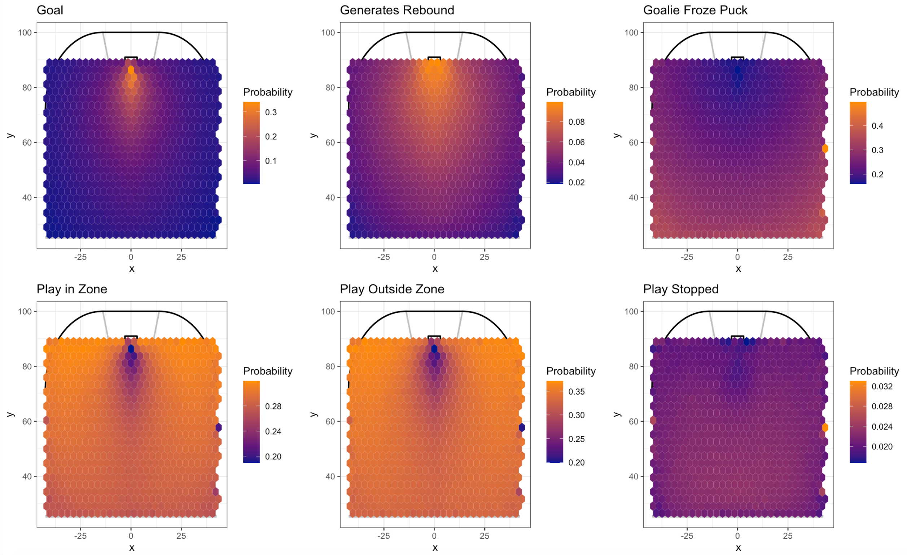
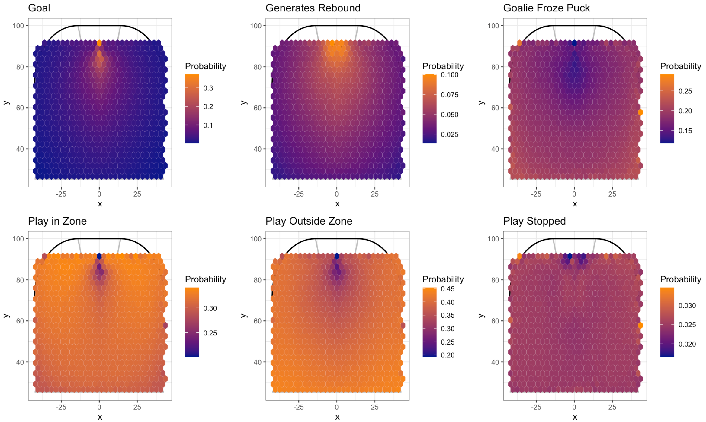
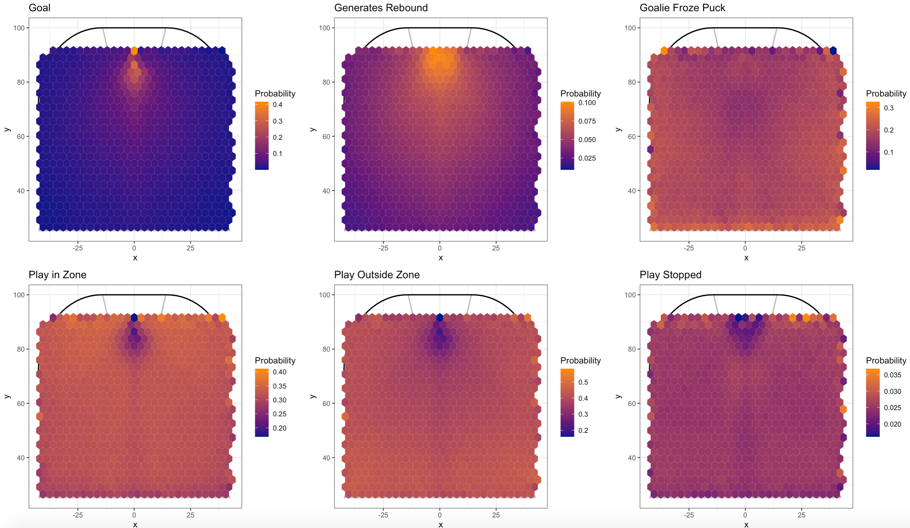

```{r setup, include=FALSE}
options(htmltools.dir.version = FALSE)
knitr::opts_chunk$set(
    fig.retina = 3,
    cache = FALSE,
    echo = FALSE,
    message = FALSE,
    warning = FALSE,
    fig.show = TRUE,
    hiline = TRUE)
```

```{r xaringan-themer, include = FALSE, warning = FALSE}
library(xaringanthemer)
style_mono_accent(base_color = "#4d54a5",
  white_color = "#FFFFFF",
  background_color = "#FFFFFF",
  base_font_size = "24px"
)
```

```{r load-packages, warning = FALSE, message = FALSE, echo = FALSE}
library(tidyverse)
library(nnet)

theme_reach <- function() {
  theme_bw() +
    theme(
      legend.position = "bottom",
      plot.title = element_text(size = 20, hjust = 0.5, face = "bold"),
      plot.subtitle = element_text(size = 12, hjust = 0.5),
      axis.title.x = element_text(size=16),
      axis.title.y = element_text(size=16)
    )
}
```

```{r}
load("all_loso_cv_preds.RData")
load("ongoal_loso_cv_preds.RData")
load("all_loso_cv_preds2.RData")
```


### Calibrate on ShotOnGoal 
```{r include=FALSE}
ep_cv_loso_calibration_results <- ongoal_loso_cv_preds %>%
  pivot_longer(Goal:PlayStopped,
               names_to = "outcome_type",
               values_to = "pred_prob") %>%
  mutate(bin_pred_prob = round(pred_prob / 0.03) * 0.03) %>%
  group_by(outcome_type, bin_pred_prob) %>%
  dplyr::summarize(n_plays = n(),
            n_scoring_event = length(which(outcome == outcome_type)),
            bin_actual_prob = n_scoring_event / n_plays,
            bin_se = sqrt((bin_actual_prob * (1 - bin_actual_prob)) / n_plays)) %>% 
  ungroup() %>%
  mutate(bin_upper = pmin(bin_actual_prob + 2 * bin_se, 1),
         bin_lower = pmax(bin_actual_prob - 2 * bin_se, 0))
```

```{r fig.align='center',out.width="70%"}
ep_cv_loso_calibration_results %>%
  ggplot(aes(x = bin_pred_prob, y = bin_actual_prob)) +
  geom_abline(slope = 1, intercept = 0, color = "black", linetype = "dashed") +
  geom_smooth(se = FALSE) +
  geom_point(aes(size = n_plays)) +
  geom_errorbar(aes(ymin = bin_lower, ymax = bin_upper)) + 
  coord_equal() +
  scale_x_continuous(limits = c(0, 1)) +
  scale_y_continuous(limits = c(0, 1)) +
  theme_bw() +
  theme(legend.position = c(1, .05),
        legend.justification = c(1, 0),
        strip.background = element_blank(),
        axis.text.x = element_text(angle = 90)) +
  facet_wrap(~ outcome_type, ncol = 3)+
  theme_reach()
```

---

## Heatmap for ShotOnGoal

```{r, echo=FALSE, fig.align='center'}

```


---


### Calibrate on All Condition

```{r include=FALSE}
ep_cv_loso_calibration_results <- all_loso_cv_preds %>%
  pivot_longer(Goal:PlayStopped,
               names_to = "outcome_type",
               values_to = "pred_prob") %>%
  mutate(bin_pred_prob = round(pred_prob / 0.03) * 0.03) %>%
  group_by(outcome_type, bin_pred_prob) %>%
  dplyr::summarize(n_plays = n(),
            n_scoring_event = length(which(outcome == outcome_type)),
            bin_actual_prob = n_scoring_event / n_plays,
            bin_se = sqrt((bin_actual_prob * (1 - bin_actual_prob)) / n_plays)) %>% 
  ungroup() %>%
  mutate(bin_upper = pmin(bin_actual_prob + 2 * bin_se, 1),
         bin_lower = pmax(bin_actual_prob - 2 * bin_se, 0))
```

```{r fig.align='center',out.width="80%"}
ep_cv_loso_calibration_results %>%
  ggplot(aes(x = bin_pred_prob, y = bin_actual_prob)) +
  geom_abline(slope = 1, intercept = 0, color = "black", linetype = "dashed") +
  geom_smooth(se = FALSE) +
  geom_point(aes(size = n_plays)) +
  geom_errorbar(aes(ymin = bin_lower, ymax = bin_upper)) + 
  coord_equal() +
  scale_x_continuous(limits = c(0, 1)) +
  scale_y_continuous(limits = c(0, 1)) +
  theme_bw() +
  theme(legend.position = c(1, .05),
        legend.justification = c(1, 0),
        strip.background = element_blank(),
        axis.text.x = element_text(angle = 90)) +
  facet_wrap(~ outcome_type, ncol = 4)+
  theme_reach()
```


---


## Heatmap for All Condition

```{r, echo=FALSE, fig.align='center'}

```

---

### Model with All Shots, Variable in Model for if Shot Hit Net


```{r include=FALSE}
ep_cv_loso_calibration_results <- all_loso_cv_preds2 %>%
  pivot_longer(Goal:PlayStopped,
               names_to = "outcome_type",
               values_to = "pred_prob") %>%
  mutate(bin_pred_prob = round(pred_prob / 0.03) * 0.03) %>%
  group_by(outcome_type, bin_pred_prob) %>%
  dplyr::summarize(n_plays = n(),
            n_scoring_event = length(which(outcome == outcome_type)),
            bin_actual_prob = n_scoring_event / n_plays,
            bin_se = sqrt((bin_actual_prob * (1 - bin_actual_prob)) / n_plays)) %>% 
  ungroup() %>%
  mutate(bin_upper = pmin(bin_actual_prob + 2 * bin_se, 1),
         bin_lower = pmax(bin_actual_prob - 2 * bin_se, 0))
```

```{r fig.align='center',out.width="65%"}
ep_cv_loso_calibration_results %>%
  ggplot(aes(x = bin_pred_prob, y = bin_actual_prob)) +
  geom_abline(slope = 1, intercept = 0, color = "black", linetype = "dashed") +
  geom_smooth(se = FALSE) +
  geom_point(aes(size = n_plays)) +
  geom_errorbar(aes(ymin = bin_lower, ymax = bin_upper)) + 
  coord_equal() +
  scale_x_continuous(limits = c(0, 1)) +
  scale_y_continuous(limits = c(0, 1)) +
  theme_bw() +
  theme(legend.position = c(1, .05),
        legend.justification = c(1, 0),
        strip.background = element_blank(),
        axis.text.x = element_text(angle = 90)) +
  facet_wrap(~ outcome_type, ncol = 3)+
  theme_reach()
```

---

## Heat Maps for Model

```{r}

```


