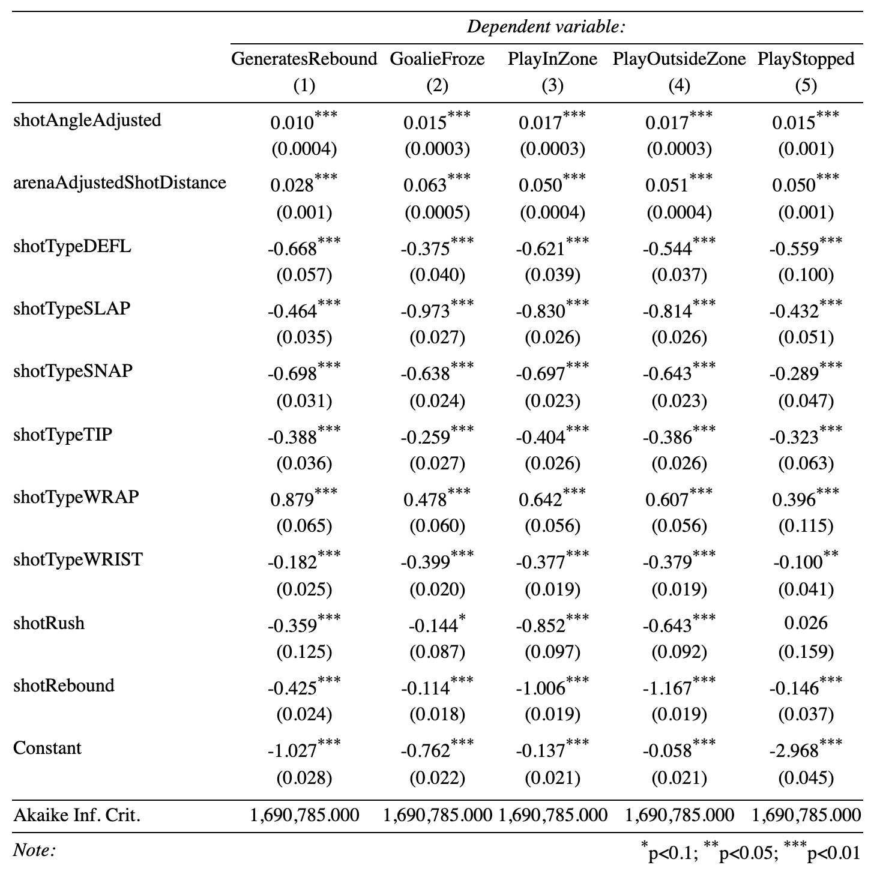
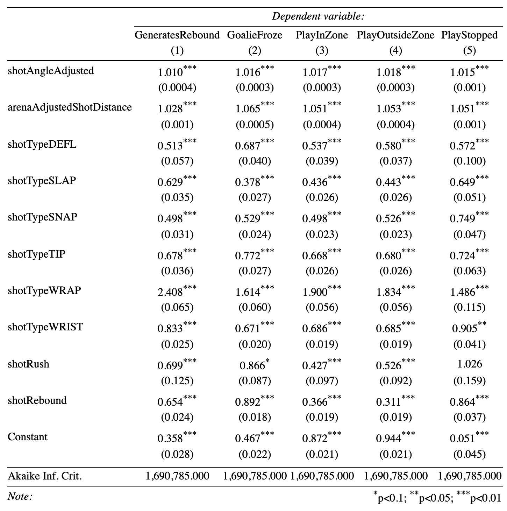

```{r setup, include=FALSE}
options(htmltools.dir.version = FALSE)
knitr::opts_chunk$set(
    fig.retina = 3,
    cache = FALSE,
    echo = FALSE,
    message = FALSE,
    warning = FALSE,
    fig.show = TRUE,
    hiline = TRUE)
```

```{r xaringan-themer, include = FALSE, warning = FALSE}
library(xaringanthemer)
style_mono_accent(base_color = "#4d54a5",
  white_color = "#FFFFFF",
  background_color = "#FFFFFF",
  base_font_size = "24px"
)
```

```{r load packages and data, include = FALSE}
# Load packages
library(tidyverse)
library(data.table)
library(haven)
library(sjPlot)
library(DiagrammeR)
library(nnet)
library(stargazer)
library(effects)
library(sjPlot)
library(sjmisc)

# Load data
shots2020 <- read_csv("data/shots_2020.csv")
shots0719 <- read.csv("data/shots_2007-2019.csv")

# Filter data
shots1019 <- shots0719 %>% 
  filter(season>2009)

variable<- c("arenaAdjustedShotDistance","shotWasOnGoal","shotPlayStopped","shotAngle","shotGoalieFroze","shotPlayContinuedInZone","shotPlayContinuedOutsideZone","awaySkatersOnIce","homeSkatersOnIce","season","shotAngleAdjusted","arenaAdjustedShotDistance","goal","shotGeneratedRebound", "xCordAdjusted", "yCordAdjusted","shotType","shotRush","shotRebound")

recent_season <- rbind(select(shots1019,all_of(variable)),select(shots2020,all_of(variable)))

evenstrength <- 
  shots2020 %>% 
  filter(xCordAdjusted %in% c(25:89),
         yCordAdjusted %in% c(-42:42)) %>% 
  filter(homeSkatersOnIce==5 & awaySkatersOnIce==5)

ongoal <- recent_season %>% 
  filter(shotWasOnGoal==1,
         !is.na(shotType),
         shotType!="")

ongoal<-ongoal%>% 
  mutate(outcome=case_when(shotGoalieFroze==1 ~ "GoalieFroze",
                           goal==1 ~"Goal",
                           shotGeneratedRebound == 1 ~ "GeneratesRebound",
                           shotPlayContinuedInZone == 1 ~ "PlayInZone",
                           shotPlayContinuedOutsideZone == 1 ~ "PlayOutsideZone",
                           shotPlayStopped == 1 ~ "PlayStopped"))


ongoal$outcome <- relevel(as.factor(ongoal$outcome),ref="Goal")
ongoal$shotType <- as.factor(ongoal$shotType)

test <- multinom(outcome ~ shotAngleAdjusted+arenaAdjustedShotDistance+
                   shotType+shotRush+shotRebound,
                 data = ongoal)
  
```


## The Problem

* <p> Our Question: How do different shot angles and distances impact the outcome of the shot? </p>
* <p> Have been looking different models for each outcome </p>
* <p> Now want to see a model that incorporates multiple outcomes </p>

---

## Basic Logistic Model

```{r, echo=FALSE, out.width="55%",fig.align='center'}
knitr::include_graphics("EDA_0716_files/xG_logit_even.png")
```

---

## Basic Logistic Model
```{r}
xG_logit_even <- glm(goal ~                        shotAngleAdjusted+arenaAdjustedShotDistance+shotType+shotRush+shotRebound,
                     data = evenstrength,
                     family = binomial("logit"))

reb_logit_even <- glm(shotGeneratedRebound ~                        shotAngleAdjusted+arenaAdjustedShotDistance+shotType+shotRush+shotRebound,
                      data = evenstrength,
                      family = binomial("logit"))

froze_logit_even <- glm(shotGoalieFroze ~                        shotAngleAdjusted+arenaAdjustedShotDistance+shotType+shotRush+shotRebound,
                        data = evenstrength,
                        family = binomial("logit"))

inZone_logit_even <- glm(shotPlayContinuedInZone ~                        shotAngleAdjusted+arenaAdjustedShotDistance+shotType+shotRush+shotRebound,
                         data = evenstrength,
                         family = binomial("logit"))

outZone_logit_even <- glm(shotPlayContinuedOutsideZone ~                        shotAngleAdjusted+arenaAdjustedShotDistance+shotType+shotRush+shotRebound,
                          data = evenstrength,
                          family = binomial("logit"))

stop_logit_even <- glm(shotPlayStopped ~                        shotAngleAdjusted+arenaAdjustedShotDistance+shotType+shotRush+shotRebound,
                       data = evenstrength,
                       family = binomial("logit"))

shotOnGoal_logit_even <- glm(shotWasOnGoal ~                        shotAngleAdjusted+arenaAdjustedShotDistance+shotType+shotRush+shotRebound,
                             data = evenstrength,
                             family = binomial("logit"))

```

```{r}
AngleCoe<-c(xG_logit_even$coefficients[[2]],
         reb_logit_even $coefficients[[2]],
         froze_logit_even$coefficients[[2]],
         inZone_logit_even$coefficients[[2]],
         outZone_logit_even$coefficients[[2]],
         stop_logit_even$coefficients[[2]],
         shotOnGoal_logit_even$coefficients[[2]])

AngleSE<- c(broom::tidy(xG_logit_even)$std.error[[2]],
    broom::tidy(reb_logit_even)$std.error[[2]],
    broom::tidy(froze_logit_even)$std.error[[2]],
    broom::tidy(inZone_logit_even)$std.error[[2]],
    broom::tidy(outZone_logit_even)$std.error[[2]],
    broom::tidy(stop_logit_even)$std.error[[2]],
    broom::tidy(shotOnGoal_logit_even)$std.error[[2]])

coe<-data.frame(outcome=c("xG","rebound","froze","inZone","outZone","stop","shotOnGoal"),
                AngleCoe=AngleCoe,AngleSE=AngleSE)

coe$outcome<-relevel(as.factor(coe$outcome),"xG","rebound","froze","inZone","outZone","stop","shotOnGoal")
```

```{r fig.show="hold", out.width = "70%",fig.align='center'}
coe%>% 
  ggplot(aes(y=outcome,x=AngleCoe))+
  geom_point(size = 0.5)+
  geom_errorbarh(aes(xmax=AngleCoe+AngleSE, xmin=AngleCoe-AngleSE), height = 0.15, colour = "red")+
  coord_flip()+
  theme_bw()+
  labs(title = "Shot Angle Coefficient") 
```

---


### Flowchart of Shot Outcomes

```{r out.width = "80%",fig.align="center"}
grViz(diagram = "digraph flowchart {
      node [ fontname = TimesNewRoman, shape = rectangle, color = Lavender, style = filled]
      tab1 [label = '@@1']
      tab2 [label = '@@2']
      tab3 [label = '@@3']
      tab4 [label = '@@4']
      tab5 [label = '@@5']
      tab6 [label = '@@6']
      tab7 [label = '@@7']
      tab8 [label = '@@8']
      tab9 [label = '@@9']
      tab10 [label = '@@10']
      
      tab1 -> tab2;
      tab1 -> tab3;
      tab2 -> tab4;
      tab2 -> tab5;
      tab5 -> tab6;
      tab5 -> tab7;
      tab5 -> tab8;
      tab5 -> tab9;
      tab5 -> tab10;
}
      
      [1]: 'Did the Shot Hit the Net?'
      [2]: 'Shot on Net'
      [3]: 'Shot Misses Net'
      [4]: 'Goal'
      [5]: 'Not a Goal'
      [6]: 'Goalie Freezes Puck'
      [7]: 'Shot Generates Rebound'
      [8]: 'Play Continued in Zone'
      [9]: 'Play Continued Outside Zone'
      [10]: 'Stoppage of Play'
      
      ")
```

---

### Multinomial Logit Model

```{r out.width="55%",fig.align='center'}

```

---

### Relative Risk Ratios of Model

* Exponentiated value of the logit coefficients

```{r out.width="55%",fig.align='center'}

```


---

### Examining Predicted Probabilities for Shot Type

```{r fig.show="hold", out.width = "50%",fig.align='center'}
plot(Effect("shotType", test), multiline = T) 

```


